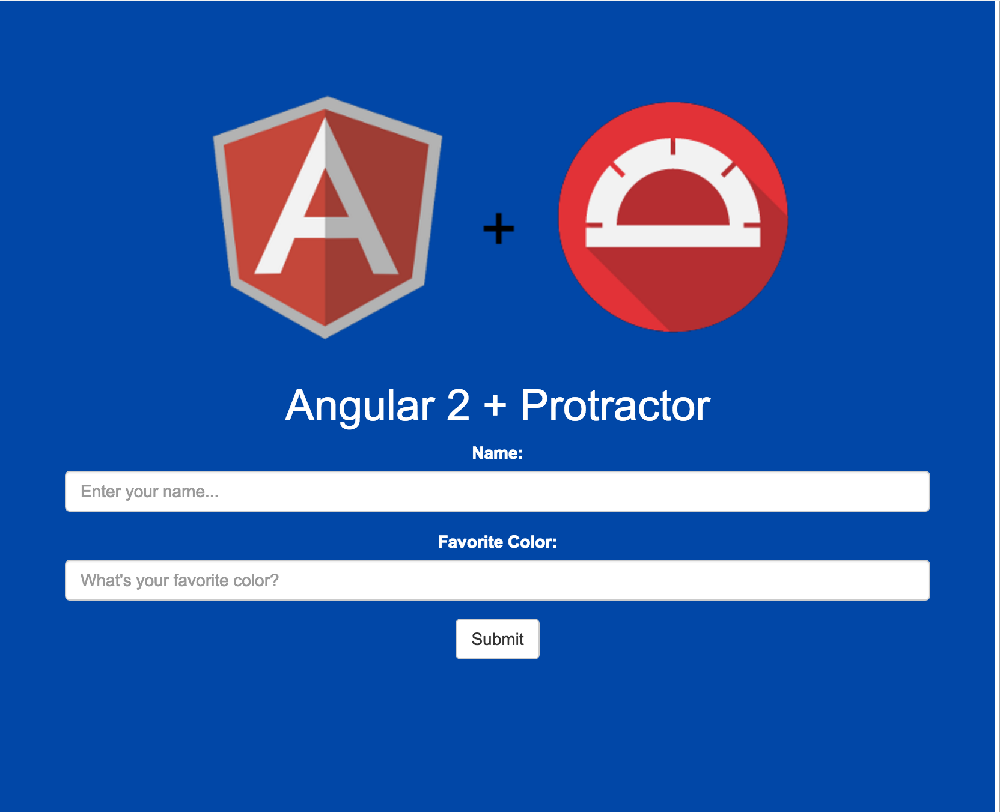
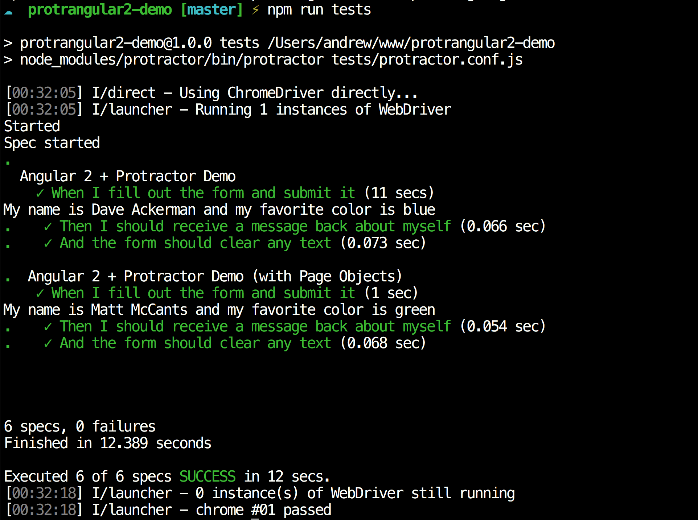

# protrangular2-demo
Demo for NoVAJS talk on getting started with Protractor in Angular 2

## Getting started

Clone the repo and from the project root type:
```
npm install
node_modules/protractor/bin/webdriver-manager update
```
This will install all the necessary dependencies and update chromedriver.
Afterwards, start the Angular2 dev server by typing:
```
npm run start
```
This will start the demo application on `localhost:8080`. You can confirm by navigating to this address in your browser.
You should see something like this:



## Running tests
Running tests is easy. From the root of the project run:
```
npm run tests
```
This will run all spec files defined in `tests/protractor.conf.js`. Feel free to fork and write your own spec files!
Upon running tests, your output should look something like this:



**NOTE:** You can remove the sleeps from `demo-spec-1.js` if you'd like that spec to run faster. Sleeps are in place for demo only.

## Additional Resources
- [Protractor API Docs](http://www.protractortest.org/#/api)
- [Angular 2 Quickstart with Typescript](https://angular.io/docs/ts/latest/quickstart.html)
- [Protractor & Page Objects](http://moduscreate.com/protractor-and-page-objects/)
